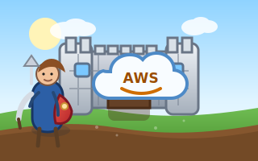

# cohort – AI Agent Cloud Incident Response

<p align="center">
  
</p>

An automated, AI-assisted cloud incident response system that runs on AWS.
Designed to integrate with your SIEM (Google SecOps / Chronicle) so that a GuardDuty
alert automatically triggers a full triage workflow—collecting evidence, reasoning over
it with Amazon Bedrock (Claude), and posting the verdict back to your SIEM case.

---

## Architecture

```
GuardDuty Alert
      │
      ▼
Google SecOps (SIEM)
      │  EventBridge event
      │  (includes ticket_number)
      ▼
AWS EventBridge Custom Bus
      │
      ▼
Step Functions State Machine
      │
      ├─► Lambda: enrich_alert
      │       GuardDuty finding details
      │       CloudTrail events (last 24 h)
      │       EC2 / IAM metadata
      │
      ├─► Lambda: collect_artifacts
      │       Uploads raw artifacts to S3
      │       s3://<bucket>/<ticket_number>/
      │           guardduty_finding.json
      │           cloudtrail_events.json
      │           vpc_flow_logs.json
      │           ec2_metadata.json
      │
      ├─► Lambda: ai_analysis
      │       Invokes Amazon Bedrock (Claude)
      │       Returns structured verdict:
      │           TRUE_POSITIVE | FALSE_POSITIVE | INCONCLUSIVE
      │
      ├─► Lambda: store_artifacts
      │       Saves AI recommendation to S3:
      │           ai_recommendation.txt   (human-readable)
      │           ai_recommendation.json  (structured)
      │           incident_summary.json   (full context)
      │
      └─► Lambda: notify_siem
              Posts verdict as case comment
              back to Google SecOps via API
```

---

## Repository Layout

```
cohort/
├── lambdas/
│   ├── enrich_alert/       # Step 1: Fetch GuardDuty + CloudTrail + EC2/IAM context
│   ├── collect_artifacts/  # Step 2: Download and store raw log artifacts in S3
│   ├── ai_analysis/        # Step 3: Amazon Bedrock AI analysis and verdict
│   ├── store_artifacts/    # Step 4: Write AI recommendation and full summary to S3
│   └── notify_siem/        # Step 5: Send verdict back to Google SecOps
├── terraform/              # Terraform IaC (EventBridge, Step Functions, Lambda, S3, IAM)
├── tests/                  # pytest unit tests for all Lambda functions
├── requirements.txt        # Runtime Python dependencies
├── requirements-dev.txt    # Development/test dependencies
└── pytest.ini              # pytest configuration
```

---

## Prerequisites

| Tool | Version |
|---|---|
| Python | 3.12 |
| Terraform | ≥ 1.5 |
| AWS CLI | ≥ 2.x |
| AWS account | with GuardDuty enabled |

---

## Deployment

### 1. Install Python dependencies (for local testing)

```bash
pip install -r requirements-dev.txt
```

### 2. Run tests

```bash
pytest
```

### 3. Configure Terraform variables

Create a `terraform/terraform.tfvars` file (this file is git-ignored):

```hcl
aws_region   = "us-east-1"
environment  = "prod"
project_name = "ir"

# Optional – leave empty to auto-generate
artifacts_bucket_name = ""

# Amazon Bedrock model (Claude 3.5 Sonnet by default)
bedrock_model_id = "anthropic.claude-3-5-sonnet-20240620-v1:0"

# Google SecOps integration (optional – leave empty to skip SIEM notification)
google_secops_api_endpoint           = "https://backstory.googleapis.com"
google_secops_customer_id            = "your-chronicle-customer-id"
google_secops_credentials_secret_arn = "arn:aws:secretsmanager:us-east-1:123456789012:secret/ir/secops-creds"
```

### 4. Deploy infrastructure

```bash
cd terraform
terraform init
terraform plan
terraform apply
```

### 5. Store Google SecOps credentials in Secrets Manager

The `notify_siem` Lambda reads a Google service-account JSON from AWS Secrets Manager.

```bash
aws secretsmanager create-secret \
  --name ir/secops-creds \
  --secret-string "$(cat path/to/service-account.json)"
```

---

## Google SecOps (SIEM) Integration

### Sending events to EventBridge

Configure your Google SecOps SOAR playbook to forward GuardDuty alerts to the
EventBridge custom bus. The event **must** include a `ticket_number` in the detail
payload so the workflow can create the correct S3 folder.

**Example event payload:**

```json
{
  "source": "com.google.secops",
  "detail-type": "IncidentResponse",
  "detail": {
    "ticket_number": "INC-12345",
    "alert_type": "GuardDuty",
    "severity": "HIGH",
    "finding_id": "abc123def456...",
    "account_id": "123456789012",
    "region": "us-east-1",
    "resource_type": "Instance",
    "resource_id": "i-0123456789abcdef0",
    "description": "EC2 instance communicating with known malicious IP",
    "secops_case_id": "CASE-9876"
  }
}
```

### Receiving results

Once the workflow completes, you will find the following files in S3:

```
s3://<bucket>/INC-12345/
    guardduty_finding.json
    cloudtrail_events_enrichment.json
    vpc_flow_logs.json
    cloudtrail_logs_insights.json
    ec2_metadata.json
    iam_context.json
    ai_recommendation.txt    # Human-readable verdict
    ai_recommendation.json   # Structured verdict
    incident_summary.json    # Full context dump
```

---

## AI Verdict Schema

```json
{
  "verdict": "TRUE_POSITIVE",
  "confidence": "HIGH",
  "reasoning": "Detailed step-by-step analysis...",
  "threat_summary": "One-paragraph summary of the threat",
  "indicators_of_compromise": ["DNS query to pool.minexmr.com"],
  "false_positive_indicators": [],
  "recommendations": ["Isolate the EC2 instance immediately"],
  "mitre_attack_techniques": ["T1496"]
}
```

**Verdict values:**
- `TRUE_POSITIVE` – confirmed malicious activity; take immediate action
- `FALSE_POSITIVE` – benign activity; close the alert
- `INCONCLUSIVE` – insufficient evidence; manual investigation required

---

## Security Considerations

- S3 artifacts bucket enforces HTTPS-only access and SSE-KMS encryption
- IAM roles follow least-privilege principles
- Google SecOps credentials are stored in AWS Secrets Manager, never in code
- EventBridge bus only accepts events matching the configured source pattern
- S3 bucket public access is fully blocked
- Object versioning is enabled on the artifacts bucket

---

## License

Apache-2.0 – see [LICENSE](LICENSE).
